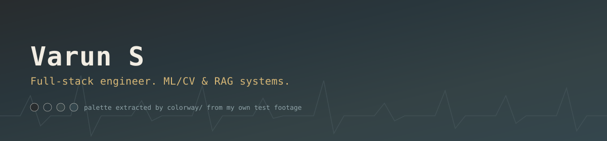

  

  

I build things across the stack, then go back and check whether they're actually correct — a tracker that demos well but has never been evaluated on unseen subjects isn't finished, it's just unverified. That gap is most of what I find interesting.

Software Engineer Intern at **L7 Informatics** (RAG assistant + CI automation). Before that, real-time lane detection with YOLOv8 at the **National University of Singapore**.

 

  

 

<b>colorway</b> — serverless design-asset pipeline (AWS Lambda, Step Functions, Rekognition, React)

 

S3 upload → Step Functions runs thumbnail generation → dominant-color extraction → Rekognition auto-tagging → DynamoDB. React gallery on top, filterable by color and tag.

*Field note: the color palette in the banner above was extracted by this pipeline's own `color_extraction.py`, run against real test footage — not a design tool.*

[→ repo](https://github.com/VarunS05/colorway)

<b>eeg-ecg-emotion-recognition</b> — valence/arousal/dominance from EEG + ECG signals (DREAMER benchmark)

 

Subject-independent cross-validation, reported next to a majority-class baseline instead of one accuracy number. An earlier version of this used labels derived from the same features it was predicting — technically high accuracy, structurally meaningless. Rebuilt on real self-report ground truth.

[→ repo](https://github.com/VarunS05/eeg-ecg-emotion-recognition)

<b>stocksavvy</b> — sentiment-aware price forecasting (VADER, chronological CV)

 

News sentiment + technical indicators, evaluated with a chronological train/test split against a random-walk baseline. Most of the honest finding here is negative: the model doesn't beat "assume no change" — which is itself the correct, unglamorous result for short-horizon return forecasting.

[→ repo](https://github.com/VarunS05/stocksavvy)

<b>video-analytics-toolkit</b> — classical CV: tracking, counting, dwell-time (OpenCV)

 

Background-subtraction tracking, entry/exit line-crossing counts, multi-object dwell-time via a centroid tracker. No neural net — the interesting part is getting the classical techniques right.

[→ repo](https://github.com/VarunS05/video-analytics-toolkit)

 

  

 

**Published**

<table>
<tr>
<td width="50%" valign="top">

  
An Optimized ICT Framework for Lung Cancer Using Recursive Information Gain and Feature Elimination — EAI BODYNETS / Bharat 6G Workshop 2024
</td>
<td width="50%" valign="top">

  
A Hybrid Deep Learning Algorithm for Improved ChatBot Accuracy and Relevance through Advanced RAG — ICSES 2024
</td>
</tr>
</table>

 

  
  

  

